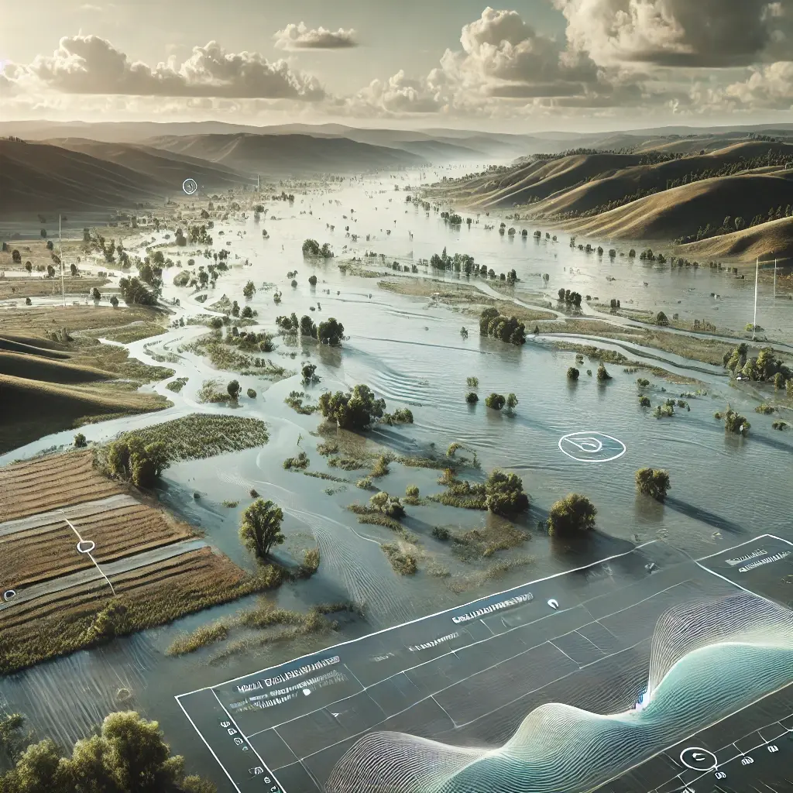

<!-- <p align="center">
  
</p> -->

<h1 align="center">HydroDL2: Differentiable Hydrologic Models</h1>

<p align="center">
  <a href="https://www.python.org/downloads/"></a>
  <a href="https://pypi.org/project/hydrodl2/"></a>
  <a href="https://pypi.org/project/torch/"></a>
  </br>
  <a href="https://github.com/astral-sh/ruff"></a>
  <a href="https://github.com/mhpi/hydrodl2/actions/workflows/pytest.yaml"></a>
  <a href="LICENSE"></a>
</p>

---

</br>

A library of hydrological models developed on PyTorch and designed alongside [𝛿MG](https://github.com/mhpi/generic_deltamodel) for the creation of end-to-end [differentiable models](https://www.nature.com/articles/s43017-023-00450-9), enabling parameter learning, bias correction, missing process representation, and more.

See [`𝛿MG/examples`](https://github.com/mhpi/generic_deltamodel/tree/master/example/hydrology) using HydroDL2-based HBV models for published differentiable parameter learning (dPL) applications.

</br>

## Installation

```bash
uv pip install hydrodl2
```

For development installs, see [setup](./docs/setup.md).


## Quick Start

```python
import hydrodl2

# List all available models
hydrodl2.available_models()
# {'hbv': ['hbv', 'hbv_1_1p', 'hbv_2', 'hbv_2_hourly', 'hbv_2_mts', 'hbv_adj']}

# Load a model class
Hbv = hydrodl2.load_model('hbv')

# Instantiate and use in a differentiable pipeline
model = Hbv()
```

Models are standard `torch.nn.Module` subclasses and can be composed with neural networks via [&delta;MG](https://github.com/mhpi/generic_deltamodel) for end-to-end differentiable training.

</br>

## Available Models

| Model | Name | Description |
|-------|------|-------------|
| HBV 1.0 | `hbv` | Base differentiable HBV model |
| HBV 1.1p | `hbv_1_1p` | HBV with capillary rise modification |
| HBV 2.0 | `hbv_2` | Multi-scale HBV with elevation-dependent parameters |
| HBV 2.0 Hourly | `hbv_2_hourly` | Sub-daily variant of HBV 2.0 |
| HBV 2.0 MTS | `hbv_2_mts` | Multi-timescale variant of HBV 2.0 |
| HBV Adjoint | `hbv_adj` | Implicit scheme with adjoint-based gradients |

</br>

## Repository Structure

```text
.
├── src/
│   └── hydrodl2/
│       ├── api/                   # Main API
│       │   ├── __init__.py
│       │   └── methods.py         # Methods exposed to end-users
│       ├── core/                  # Methods used internally
│       ├── models/                # Shared models directory
│       │   └── hbv/               # HBV model variants
│       └── modules/               # Augmentations for δMG models
├── docs/
├── tests/
└── pyproject.toml
```

## Citation

This work is maintained by [MHPI](http://water.engr.psu.edu/shen/) and advised by [Dr. Chaopeng Shen](https://water.engr.psu.edu/shen/). If you find it useful, please cite:

> Shen, C., et al. (2023). Differentiable modelling to unify machine learning and physical models for geosciences. *Nature Reviews Earth & Environment*, 4(8), 552--567. https://doi.org/10.1038/s43017-023-00450-9

<details>
<summary>BibTeX</summary>

```bibtex
@article{shen2023differentiable,
  title={Differentiable modelling to unify machine learning and physical models for geosciences},
  author={Shen, Chaopeng and others},
  journal={Nature Reviews Earth \& Environment},
  volume={4},
  number={8},
  pages={552--567},
  year={2023},
  publisher={Nature Publishing Group},
  doi={10.1038/s43017-023-00450-9}
}
```
</details>

<!-- ## License

HydroDL2 is released under a **Non-Commercial Software License Agreement** by The Pennsylvania State University. It is free for non-commercial use. Commercial use requires prior written consent from PSU. See [LICENSE](./LICENSE) for full terms.

For commercial licensing inquiries, contact the Office of Technology Management at 814.865.6277 or otminfo@psu.edu. -->

## Contributing

We welcome contributions! See [CONTRIBUTING.md](./docs/CONTRIBUTING.md) for details.

---

*Please submit an [issue](https://github.com/mhpi/hydrodl2/issues) to report any questions, concerns, or bugs.*
